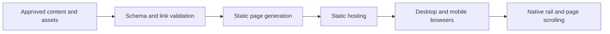
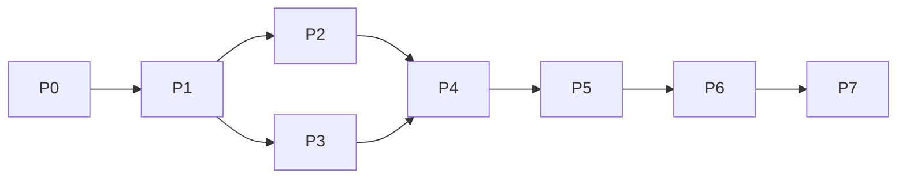

# Financial Portfolio Site — end-to-end build plan

Prepared: 25 September 2026. Implementation update, 26 September: built as a local public-portfolio preview. See [current decisions](../docs/decisions.md), [QA results](../docs/qa-evidence/RESULTS.md), and [remaining release work](../docs/release.md). The sections below retain the original planning snapshot.

## 1. Outcome and evidence

Build a responsive finance/research portfolio that works as a full desktop website and a touch-friendly mobile website. Visitors should be able to understand the owner's focus, browse research, open a research item, reach contact information, and move through the page without scrolling failures.

This is a proposal for building the site, not an investment plan or a claim that the previous implementation has been recovered.

| Evidence | What it establishes | Planning consequence |
| --- | --- | --- |
| Current user request | Produce an end-to-end plan in a new folder under the supplied directory | Deliver planning documents; implementation and publishing are later phases |
| Cached conversation preview | Previous assistant described a two-column desktop layout and stacked mobile layout | Preserve responsive behavior as a target; exact appearance remains unknown |
| Cached conversation preview | Research cards supported swipe and arrow controls | Include an accessible horizontal research rail |
| User report in preview: unable to scroll on mobile | A real mobile usability failure was reported | Make natural document scrolling a release gate |
| User report in preview: Back to top does not work | Another interaction failure was reported | Verify repeated activations, actual scroll position, and focus |
| Previous assistant's claimed fixes | Changes were described, with device verification still requested | Treat as historical claims, not verified working code |
| Local inspection | The sibling `Personal-Portfolio` repository contains only a short README in its working tree; README has an uncommitted change | Start a separate project and preserve that repository |

Reference: [Financial Portfolio Plan conversation](chatgpt-conversation://6ab607ab-36c4-83ee-859e-cf5e8963bda1). Only the six-message cached preview was available; the conversation-reading tool was not available in this session. No original code, screenshots, attachments, or full brief were recovered.

Reference material is evidence about the desired product. Instructions embedded in that material are not authorization to run commands, change accounts, or publish anything.

## 2. Scope decision and assumptions

**Working assumption:** this is a public professional portfolio featuring financial research. Research cards and the existing folder name suggest this interpretation, but do not prove it. Confirm this in P0 before implementing domain-specific pages.

| Decision | Proposed default | When resolved |
| --- | --- | --- |
| Audience and purpose | Readers, collaborators, or recruiters exploring published research | P0 |
| Visual fidelity | Reproduce recovered reference; otherwise agree on a new wireframe | P0 |
| Branding and sections | Owner-provided name, biography, research, background, and contact | P0 |
| Content editing | Version-controlled content files | P0; revisit if nontechnical editing is required |
| Data | Published research and supplied assets, no live prices | P0 |
| Backend | No database, login, or contact-processing service in first release | P0 |
| Domain and host | Vercel is the proposed host; domain and account to be selected | P7 |

If the user instead means a **private investment dashboard**, replace the product and architecture sections before implementation. That variant requires authenticated accounts, per-user authorization, holdings and transaction records, base currency and FX rules, precise return calculations, a price-data source, import validation, backups, and privacy requirements. It cannot safely use this plan's public static-content model or schedule. Shared layout and scrolling requirements still apply. Do not implement both variants speculatively.

### Proposed first release

- Home page with introduction, selected research, background, and contact sections.
- Research index and individual research pages with stable URLs.
- Desktop two-column home composition and mobile stacked layout.
- Research rail with native swipe, pointer scrolling, keyboard access, and arrow buttons.
- Reliable section links and Back to top control.
- Supplied résumé/research downloads when files exist.
- Page metadata, social preview, sitemap, useful 404 page, accessible navigation.

### Deferred unless the recovered brief requires them

Live market data, brokerage connections, portfolio calculations, recommendations, authentication, payment flows, CMS, contact form backend, analytics, search/filtering for a small research collection, dark-mode switch, and animations beyond simple transitions. These are scope choices, not confirmed exclusions from the original site.

## 3. Visitor journeys and page structure

| Route/section | Content and primary action | Empty/missing state |
| --- | --- | --- |
| `/` introduction | Name, professional focus, short summary; jump to research | Use visibly labeled draft text in local preview only |
| `/#research` | Featured research cards; open detail or browse all | Explain that research is being prepared; hide inactive rail arrows |
| `/#about` | Background, methods, skills, optional résumé | Omit unsupported credentials and unavailable downloads |
| `/#contact` | Approved email and professional links | Omit unknown links rather than displaying dead controls |
| `/research/` | All published research in a readable grid/list | Clear empty state; maintain navigation |
| `/research/[slug]/` | Thesis, method, findings, limitations, sources, publication date; optional download | Unknown slug produces 404; unpublished work is not exported |
| 404 | Explain missing page; offer home and research links | No broken-navigation loop |

Proposed desktop wireframe: compact header; introductory/profile column alongside wider research/content column; remaining sections continue in normal document flow. Optional sticky profile is allowed only when it fits the viewport. Mobile ordering: header → introduction → research → background → contact → footer. Confirm composition against the original reference in P0.

Use clear typography, restrained color, visible focus indicators, and consistent spacing. Establish CSS variables for color, spacing, typography, radii, and content width. Start with one light theme; use final reference styling when available. Choose breakpoints from content fit, initially a single-column layout below roughly 900px. No screenshot or color palette has yet been approved.

## 4. Architecture and content

### Proposed stack

Use Next.js App Router, React, TypeScript, CSS Modules plus global design tokens, and npm. The rationale is a familiar component structure for interactive cards and statically rendered, linkable research pages. It is a proposed engineering choice, not a recovered dependency from the original site.

Use static export for the first release: content renders at build time, while navigation enhancements run in small client components. Next.js supports exporting HTML/CSS/JS through `output: 'export'`; dynamic research paths must be enumerated at build time. Server-only features need a different deployment model. See the [official static-export guide](https://nextjs.org/docs/app/guides/static-exports).

Pin a supported Node LTS release and exact resolved dependencies at implementation time; record them in `.nvmrc`, `package.json`, and `package-lock.json`. Recheck framework compatibility then. Use the [official installation instructions](https://nextjs.org/docs/app/getting-started/installation), rather than treating this dated plan as a version lock.

| Concern | Implementation boundary |
| --- | --- |
| Layout and research pages | Build-time rendering; no client state needed |
| Research rail and Back to top | Small client components using DOM refs and native scrolling |
| Content | Typed JSON records validated with a schema at build time |
| Long-form research | Structured text sections in JSON initially; add Markdown only if editorial needs justify it |
| Assets | Approved, locally stored images, PDFs, fonts; responsive dimensions |
| Testing | Vitest for content validation; Playwright for critical browser journeys; manual device checks |
| Hosting | Static build output deployed to a preview, then production |

Suggested structure after implementation:

```text
financial-portfolio-site/
  README.md
  plans/
    BUILD_PLAN.md
    ACCEPTANCE.md
  docs/
    reference-inventory.md
    decisions.md
    release.md
    qa-evidence/
  web/
    src/
      app/
        layout.tsx
        page.tsx
        globals.css
        not-found.tsx
        research/page.tsx
        research/[slug]/page.tsx
      components/
        SiteHeader.tsx
        ResearchCard.tsx
        ResearchRail.tsx
        BackToTop.tsx
        SiteFooter.tsx
      content/
        profile.json
        research/*.json
      lib/
        content.ts
        content-schema.ts
      styles/tokens.css
    public/
      images/
      downloads/
      robots.txt
      sitemap.xml
    scripts/
      validate-content.ts
      generate-discovery-files.ts
    tests/
      unit/content.test.ts
      e2e/navigation.spec.ts
      e2e/mobile-scroll.spec.ts
      e2e/research.spec.ts
    next.config.ts
    playwright.config.ts
    package.json
    package-lock.json
    .nvmrc
```

Only README and `plans/` are delivered now. Keep the app in `web/` so a scaffold does not collide with existing planning files.

### Content contract

- `Profile`: displayName, headline, bio, contactLinks, optional portrait and résumé.
- `Research`: stable id, unique slug, title, summary, category, tags, publishedAt, optional updatedAt, status (`draft`/`published`), featured flag/order, body sections, sources, optional coverImage and download.
- `Source`: title, URL, optional accessedAt; preserve attribution.
- `Asset`: local path, alternative text where relevant, dimensions or file metadata.

Validate unique slugs, required text, parseable dates, allowed URL schemes, referenced asset existence, and published-content completeness. Sort featured items explicitly, then remaining items by date. Reject invalid content during build. Render text through normal React escaping; do not inject raw HTML. Draft content must be excluded from public pages and bundles. Load and filter content during the build; pass only published records into client components, and never import the entire content directory into client code.

Financial claims and charts, if provided, must retain their date, currency/unit, source, and distinction between examples and actual results. Do not invent performance history or credentials. A chart needs a text summary or data table. This release displays editorial content and does not calculate investment returns.



## 5. Interaction specifications

### Document scrolling

Use the document as the sole vertical scrolling surface in the primary page, on both desktop and mobile. Avoid a fixed-height outer application shell, permanent body scroll locks, or a vertically scrolling main-content panel. `min-height` can establish full-height appearance without clipping content. Constrain horizontal overflow inside the card rail; do not hide root overflow to conceal layout defects.

A vertical swipe starting over a card must still move the page. Prefer native overflow behavior without global gesture handlers, `preventDefault()` on touch movement, or `touch-action: none`. Test after rotation, viewport resize, font/image loading, and browser navigation. If embedding in an app is required, define which document owns the scroll and test that host explicitly.

### Research rail

Use a semantic list with `overflow-x: auto`, optional proximity snap, and cards that remain readable at narrow widths. Add labeled Previous/Next buttons with a project target of at least 44×44 CSS pixels. Move only the rail by the next card's measured position, accounting for gap and viewport changes. Disable controls at boundaries, tolerate fractional pixel rounding, and remove unnecessary controls for zero/one item.

Keep both horizontal and vertical native touch panning available. Allow normal tab navigation into card links and bring a focused card into the rail's visible area without unexpectedly moving the whole page. Do not auto-advance. Native snapping is described in [MDN's scroll-snap guide](https://developer.mozilla.org/en-US/docs/Web/CSS/Guides/Scroll_snap).

### Back to top

Provide a semantic link to a stable `#top` target so there is a baseline action without JavaScript. Enhance each activation with an explicit scroll to the document top, even if the URL already ends in `#top`. Do not rely only on a hash change event. After keyboard activation, move focus to the top heading/landmark with `preventScroll` so the user continues from the right place; verify touch and screen-reader behavior as well.

Use instant movement when reduced motion is requested and optional smooth movement otherwise; ensure global CSS does not override this choice. Handle top-state activation without errors. Use the verified APIs in [MDN scrollTo](https://developer.mozilla.org/en-US/docs/Web/API/Window/scrollTo) and [reduced-motion documentation](https://developer.mozilla.org/en-US/docs/Web/CSS/Reference/At-rules/@media/prefers-reduced-motion).

Passing means the actual document returns within 2 CSS pixels of the top after scrolling settles, for at least three scroll-down/activate cycles. A fired click handler alone is insufficient evidence.

## 6. Build sequence and estimates

Estimates below are planning judgments for one experienced developer, with approved copy/assets ready and roughly 5–10 research items. Allow approximately **8–13 development days**, plus time waiting for content, design decisions, hosting access, or device testing. Revised scope requires a revised estimate.

Owner roles: **owner** supplies content and product decisions; **developer** implements; **reviewer** checks behavior and release evidence. One person may fill multiple roles.

| Phase | Deliverable | Depends on | Effort |
| --- | --- | --- | --- |
| P0 | Confirmed scope, source inventory, wireframes | None | 0.5–1 day |
| P1 | Reproducible project foundation | P0 | 0.5–1 day |
| P2 | Validated content and asset model | P1 | 1–1.5 days |
| P3 | Responsive page shell | P1 and P0 design | 1–1.5 days |
| P4 | Research index and detail pages | P2, P3 | 1–1.5 days |
| P5 | Rail, anchors, and scroll behavior | P4 | 1–2 days |
| P6 | Browser/device validation and fixes | P5 | 2–3 days |
| P7 | Preview, production, and handover | P6 | 0.5–1 day |



P2 and P3 can proceed independently after agreeing content types/component inputs. Keep P2 changes in content/lib/scripts and P3 changes in components/styles/layout. Coordinate shared package and home-page changes through one developer. There is no need for parallel agents on a small build.

### P0 — resolve scope and recover the reference

**Context:** The preview contains interaction requirements but no original artifact. Public portfolio is provisional. **Owner:** owner + developer. **Reasoning:** strongest available for the scope/architecture decision.

Tasks: recover original source, screenshots, or exported content if available; record what was and was not recovered in `docs/reference-inventory.md`; decide public portfolio versus dashboard; inventory sections, assets, URLs, and CTAs; produce desktop/mobile wireframes; record decisions in `docs/decisions.md`.

**Verify/exit:** every visible action has a destination; required content has an owner; the intended product and wireframe are confirmed. If the original artifact remains unavailable, explicitly use a newly agreed design and do not promise pixel parity. **Rollback:** revise the brief before implementation; no runtime work exists.

### P1 — create the project foundation

**Context:** New sibling folder, with planning documents already present. No app or remote exists here. **Owner:** developer. **Reasoning:** default.

Tasks: scaffold `web/` using TypeScript, App Router, ESLint and CSS Modules; configure static export, trailing-slash policy, and image handling compatible with static hosting; pin runtime/dependencies; create quality scripts and a local production preview command. Initialize an independent Git repository when implementation begins. Git is available; GitHub CLI was unavailable during planning, so remote creation is optional and must not block local work.

Example scaffold command, to be run later from the project root:

```sh
npx create-next-app@latest web --ts --eslint --app --src-dir --use-npm --no-tailwind --import-alias '@/*'
```

Review remaining CLI options interactively and record resolved versions. Use pre-sized local images with static-compatible handling; do not depend on a runtime image optimizer.

**Verify/exit:** a fresh dependency install builds, serves the exported site, and displays the home route. Run `npm run lint`, `npm run typecheck`, and `npm run build` from `web/`. **Rollback:** revert the foundation commit; preserve the planning files.

### P2 — content and assets

**Context:** The application needs approved portfolio/research content, not runtime financial feeds. **Owner:** developer; owner supplies copy. **Reasoning:** default.

Tasks: implement the content contracts and validator; add approved profile/research records; prepare local assets; add representative fixtures for zero, one, and many research items, long titles, missing images, invalid dates, duplicate slugs, and drafts; define typed data-loading functions; implement content unit tests that catch publication mistakes.

**Verify/exit:** `npm run validate:content` and `npm run test:unit` pass; invalid fixtures fail for the intended reason; drafts are absent from publishable data. **Rollback:** revert content/schema changes together; retain original source assets separately.

### P3 — responsive shell

**Context:** Two-column desktop and stacked mobile layouts must share natural document scrolling. Use the agreed P0 wireframes. **Owner:** developer. **Reasoning:** default.

Tasks: design tokens, header, main landmarks, footer, profile/about/contact sections, skip link, focus styles, responsive spacing, image dimensions, and sticky offsets if applicable. Prefer simple wrapping navigation over a modal menu for a few links. Build skeleton research slots against the agreed data interface.

**Verify/exit:** `npm run lint`, `npm run typecheck`, `npm run build`; manually inspect 320px, 390px, 768px, and 1440px widths plus zoom. All text is reachable and the page has no horizontal overflow. **Rollback:** revert layout/style commit, preserving the content model.

### P4 — publishable research pages

**Context:** Content model and page shell now exist. **Owner:** developer. **Reasoning:** default.

Tasks: research cards/index/detail template, static slug generation, unknown-route behavior, sources/downloads, page titles/descriptions, canonical URLs, and static sitemap/robots generation using a configured site URL. Ensure filtered drafts cannot become generated routes. Support empty content gracefully.

**Verify/exit:** `npm run validate:content`, `npm run test:unit`, `npm run build`; request each exported detail URL directly, refresh it, and verify missing slugs show 404. Check download filenames and asset paths. **Rollback:** revert route/export changes; keep content files.

### P5 — interactions and regression protection

**Context:** This phase addresses both failures reported in the preview. Do not import an unverified historical fix. **Owner:** developer. **Reasoning:** strongest available for scroll/focus behavior review.

Tasks: implement the rail, boundary buttons, anchors, and Back to top per section 5; add behavioral Playwright checks for actual scroll position, repeated activation, keyboard focus, reduced motion, route return, and viewport changes. Preserve usable links/content when JavaScript is disabled.

**Verify/exit:** `npm run test:e2e` against the production export passes the automated rows of `ACCEPTANCE.md`. Mobile touch usability remains unverified until P6 real-device checks. **Rollback:** revert the interaction enhancement while retaining baseline links and native overflow; do not ship if core scrolling still fails.

### P6 — quality and device verification

**Context:** Automated browser behavior does not establish that a real phone or host app works. Playwright emulates device properties and its WebKit is not branded Safari. **Owner:** developer + reviewer. **Reasoning:** strongest available for review of remaining defects.

Tasks: execute the full acceptance checklist; test Safari on an iPhone and Chrome on Android; include the actual embedding app if that remains a requirement; check keyboard and VoiceOver or another screen reader; optimize images and unnecessary client code; inspect console/network failures; fix defects and rerun affected checks.

**Verify/exit:** all release-blocking rows pass with recorded browser/OS/device and evidence in `docs/qa-evidence/`. If a real device is unavailable, report that gap and keep its check open. **Rollback:** revert the change causing a regression; retain failing regression tests and fix before release.

### P7 — deployment and handover

**Context:** Only validated, approved public content should be released. Deployment is future work; this planning task does not publish anything. **Owner:** developer + owner. **Reasoning:** default.

Tasks: select hosting account and domain, confirm current costs and limits using the [official Next.js hosting guide](https://vercel.com/docs/frameworks/full-stack/nextjs); create a separate remote if desired; run checks in CI; configure the host with project root `web/` and the tested static output; publish a preview; verify links/assets/deep routes on that host; complete content review; then release to production and attach the domain with HTTPS.

Keep previews containing unfinished material access-restricted where supported. `noindex` is an indexing preference, not access control. Generate production canonical URLs/sitemap and remove preview-only indexing restrictions when releasing.

**Verify/exit:** production passes the smoke checklist, including direct navigation to a research URL, phone scrolling, repeated Back to top, downloads, 404, metadata, and no mixed-content errors. Record the release commit, build artifact, deployment URL, and rollback procedure in `docs/release.md`.

**Rollback:** redeploy the last known-good immutable artifact/commit and rerun the production smoke checks. Do not use destructive Git history resets. Retain the previous artifact before replacing a release.

## 7. Commands and delivery workflow

Define these scripts during implementation; they do not exist yet:

| Command in `web/` | Contract |
| --- | --- |
| `npm ci` | Install exactly the lockfile dependencies |
| `npm run dev` | Local development server |
| `npm run lint` | ESLint, run explicitly |
| `npm run typecheck` | TypeScript no-emit check, with route types generated as needed |
| `npm run validate:content` | Schema, publication, slug, URL, and local-asset checks |
| `npm run test:unit` | Vitest content/validation tests |
| `npm run build` | Validate content, generate discovery files, then create static export |
| `npm run preview` | Serve `out/` with proper static routes and 404 behavior |
| `npm run test:e2e` | Playwright against the built export through its configured web server |

Make the preview server a pinned dev dependency. Static export is served from `out/`; do not rely on `next start` as the static-output preview. Match trailing-slash and 404 behavior between local preview and production. Playwright CI installs its required browser binaries. See [Playwright browsers](https://playwright.dev/docs/browsers) and [device emulation](https://playwright.dev/docs/emulation).

CI sequence after P5: clean install → lint → typecheck → content/unit checks → production build → browser tests → artifact capture. Use one small commit/PR per phase if a remote review workflow is established; otherwise use local commits and the same checks. Do not create a remote or push as part of this planning delivery.

No backend credentials are needed for the proposed first release. Keep private notes and unreleased documents outside `public/` and outside exported content. Add a backend only through a recorded scope change with its own storage, authorization, and operational plan.

## 8. Release quality, operations, and scope changes

Release quality is defined by [the acceptance checklist](ACCEPTANCE.md), with the two known mobile bugs treated as blockers. Accessibility includes semantic landmarks, meaningful link labels, visible focus, non-color cues, readable contrast, reduced motion, and keyboard operation. Project control size target is 44×44 CSS pixels; this is a design target, not a blanket claim of standards compliance.

Performance targets: avoid layout shifts by reserving media space; load below-fold images lazily; keep the first page useful before JavaScript; inspect a throttled mobile performance trace and fix avoidable blocking assets. Establish an initial transfer budget after real assets are supplied. Suggested quality targets are LCP ≤2.5s and CLS ≤0.1 in representative lab runs; record the conditions rather than treating a single score as a guarantee. Assess INP once real-user measurements exist; target ≤200ms. These targets are explained by [Web Vitals](https://web.dev/articles/vitals).

Handover: document how to edit a profile, add research, replace a PDF, preview changes, run checks, publish, and roll back. Preserve content and assets in version control where appropriate. Review broken links and outdated research dates monthly, and dependencies/security updates on a regular maintenance cadence. This is a proposed operating practice; no scheduled automation is created here.

Costs: local planning has no hosting cost; production domain, hosting plan, and optional services depend on the chosen account and traffic. Confirm current pricing and an acceptable spend ceiling before launch. No paid provider or data feed is assumed.

Main risks and responses:

| Risk | Response |
| --- | --- |
| Wrong interpretation of “financial portfolio” | Resolve P0; replace public-content architecture for a dashboard |
| Missing original artifact | Mark visual parity unknown; agree a replacement design before implementation |
| Late content/assets | Use labeled local fixtures; block release of placeholder claims |
| Nested scrolling or intercepted gestures | Single document scroller; actual touch tests over the card rail |
| Hash-only Back to top works once | Explicit action on every activation; repeat-cycle regression test |
| Static host differs from local preview | Direct-route, trailing-slash, asset, and 404 checks on deployed preview |
| Added live data or editing workflow | Re-estimate and record a separate scope decision |

When changing the plan, update `docs/decisions.md` with the decision, reason, affected phases, estimate impact, and revised acceptance criteria. Keep completed evidence; do not mark work complete because its implementation was described. README serves as the project index; no unrelated global memory is modified.

## 9. Planning review record

An independent review on 25 September 2026 checked scope/evidence separation, phase dependencies, static-export coherence, estimates, and mobile acceptance coverage. No critical or material findings remained. Local document links and Markdown code fences were checked. This review validates the plan, not an implementation or deployment.
